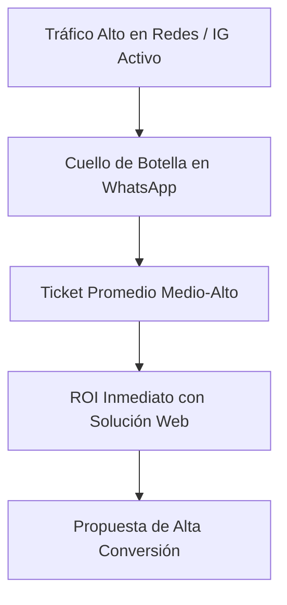

# 🇺🇾 Master Database: Prospección de Leads B2B Uruguay (Diseño & Desarrollo Web)

**Objetivo:** Base de datos comercial de negocios reales en Uruguay que operan activamente con ventas y atención manual por WhatsApp/Instagram, sin sitio web transaccional o con infraestructura digital precaria, representando oportunidades de alta conversión para la venta de servicios de desarrollo y diseño web.

---

## 📊 1. Resumen General del Relevamiento

* **Total de leads verificados:** 78 leads estructurados (seleccionados entre más de 100 negocios relevados).
* **Mercados geográficos cubiertos:** Montevideo (Pocitos, Cordón, Punta Carretas, Carrasco, Centro, Malvín, Parque Rodó, Prado, Buceo), Canelones (Ciudad de la Costa, Solymar, Lagomar, El Pinar) y Maldonado (Punta del Este, La Barra, San Carlos, Maldonado Centro).
* **Distribución por nicho:**
  1. 👗 **Moda, Ropa & Showrooms:** 12 leads
  2. ☕ **Gastronomía (Cafés de especialidad, Pastelerías, Viandas, Hamburgueserías):** 12 leads
  3. 💇‍♀️ **Estética & Belleza (Peluquerías, Barberías, Spas, Nails & Lash):** 12 leads
  4. 💪 **Fitness & Bienestar (Pilates Reformer, CrossFit, Yoga, Gyms):** 12 leads
  5. 🩺 **Salud (Odontología, Nutrición, Fisioterapia, Clínicas):** 10 leads
  6. 🐾 **Mascotas (Pet Shops, Peluquerías Caninas, Veterinarias):** 10 leads
  7. 🌸 **Otros Nichos & Regional (Tattoo Studios, Florerías, Fotografía, Academias, Mueblería de Autor):** 10 leads

---

## 🗂️ 2. Tablas Maestras de Leads por Nicho

---

### 👗 Nicho 1: Moda, Ropa & Showrooms (12 Leads)

| # | Nombre Comercial | Instagram | WhatsApp / Tel. | Ciudad / Barrio | Subcategoría | Estado Sitio Web | Punto de Dolor Principal | Prioridad |
|---|---|---|---|---|---|---|---|---|
| 1 | **Atrix Showroom** | `@atrixuy` | 097 441 444 | Montevideo - Centro / Cordón | Showroom multimarca | Web estática sin carrito | Alto volumen de consultas de precios y stock atendidas 1 a 1 por WhatsApp | **ALTA** |
| 2 | **Diversité Showroom** | `@diversite.uy` | 095 573 867 | Montevideo - Pocitos | Showroom indumentaria femenina | Catálogo sin checkout | Agenda manual de visitas al showroom en apartamento y verificación manual de prendas | **ALTA** |
| 3 | **Maharani Uruguay** | `@maharani_uy` | 099 369 494 | Montevideo - Cordón & Punta del Este | Showroom moda boho-chic | Linktree a WhatsApp | Venta asistida manual para envíos nacionales y confirmación de stock de piezas únicas | **ALTA** |
| 4 | **Nazaria Sur** | `@nazariasur` | WhatsApp en Bio | Montevideo - Pocitos / P. Carretas | Joyería de autor & accesorios | No tiene tienda online | Agenda manual de visitas y cotización por DM que frena compras por impulso | **ALTA** |
| 5 | **Tu Vestidor** | `@tuvestidor.uy` | 095 064 817 | Montevideo - Ciudad Vieja | Showroom de diseño exclusivo | Historias destacadas de IG | Pedidos, cálculo de flete (DAC/Mirtrans) y comprobantes procesados por chat | **ALTA** |
| 6 | **Actitud Sur** | `@actitudsur` | 092 919 338 | Montevideo - Punta Carretas | Boutique indumentaria femenina | Sin e-commerce activo | Envío manual de fotos de percheros y talles a clientas que consultan por WhatsApp | **ALTA** |
| 7 | **Seven Vestimenta** | `@seven_vestimenta` | 094 142 927 | Montevideo - Centro / Cordón | Indumentaria urbana y casual | No tiene web (100% DM) | Gestión desordenada de envíos por agencia y comprobantes de giros en chat | **ALTA** |
| 8 | **Sasha Vestidos** | `@sasha.uy` | 091 659 921 | Montevideo - Pocitos / P. Batlle | Alquiler vestidos de fiesta | Web informativa | Agenda de pruebas de vestidos llevada manualmente; riesgo de solapamiento | **ALTA** |
| 9 | **Acqua-Cereza** | `@acquacereza` | 098 957 275 | Montevideo - La Comercial | Ropa femenina Plus Size | Solo WhatsApp Business | Asesoramiento de medidas en cm realizado mensaje por mensaje para cada prenda | **ALTA** |
| 10 | **Indumentaria V&E** | `@indumentaria_ve_uy` | 096 810 016 | Montevideo - Sayago | Ropa multimarca | Solo catálogo WhatsApp | Falta de control de stock en tiempo real; riesgo de vender prendas agotadas | **ALTA** |
| 11 | **Victoria Liguori** | `@victorialiguoridesign` | 098 111 606 | Montevideo - Pocitos | Marroquinería de cuero | Web catálogo simple | Asesoramiento de variantes de color y personalización en hilos largos de WhatsApp | **MEDIA** |
| 12 | **Panthai Pocitos** | `@panthaiuy` | 098 234 741 | Montevideo - Pocitos | Boutique femenina | Web informativa básica | Preguntas continuas sobre stock físico en local vs. disponibilidad para envíos | **MEDIA** |

---

### ☕ Nicho 2: Gastronomía (Cafés, Pastelerías, Viandas, Burgers) (12 Leads)

| # | Nombre Comercial | Instagram | WhatsApp / Tel. | Ciudad / Barrio | Subcategoría | Estado Sitio Web | Punto de Dolor Principal | Prioridad |
|---|---|---|---|---|---|---|---|---|
| 13 | **Cardenal Coffee Roasters** | `@cardenalcafe` | 092 801 802 / 095 721 738 | Cordón & Carrasco | Café de especialidad & Tostaduría | Landing institucional | Sin menú interactivo ni take-away web; venta de granos y pedidos por chat | **ALTA** |
| 14 | **Obrador Social Club** | `@obradorsocialclub` | 095 986 330 | Montevideo - Parque Rodó | Café & Panadería masa madre | No tiene web propia | Menú en historias de IG; pedidos de panadería y reservas 100% manuales | **ALTA** |
| 15 | **La Madriguera Café** | `@lamadrigueracafe` | 095 010 424 | Montevideo - Carrasco | Café de especialidad & Brunch | Landing estática | Sin e-commerce para take away ni menú QR interactivo; atención por WhatsApp | **ALTA** |
| 16 | **What A Burger** | `@whataburger.uy` | 093 428 092 | Montevideo - Cordón / P. Rodó | Hamburguesería artesanal | No tiene web propia | Dependencia total de WhatsApp manual y altas comisiones de apps de delivery | **ALTA** |
| 17 | **HDP Smash Burger** | `@hdp.smashburger` | 092 888 894 / 091 217 068 | Pocitos & Cordón | Hamburguesería (Smash) | No tiene web interactiva | Pedidos divididos en dos WhatsApps sin centralización ni webapp de comandas | **ALTA** |
| 18 | **Las Primas** | `@lasprimas.uy` | 091 216 503 | Montevideo - Pocitos | Rotisería gourmet & Viandas | No tiene web | Menú del día en historias; pedidos y transferencias bancarias 1 a 1 en horas pico | **ALTA** |
| 19 | **Cioffi's Pastelería** | `@cioffispasteleria` | 094 400 477 | Montevideo - Malvín | Pastelería & Tortas de eventos | Catálogo estático | Cotizaciones de tortas personalizadas mediante intercambio de fotos y audios | **ALTA** |
| 20 | **La Dulcería de Xime Torres**| `@ladulceriadeximetorres`| 091 368 084 / 092 460 436 | Pocitos & Carrasco | Pastelería boutique & Salón de té | Web informativa | Gran volumen de encargos de tortas enteras saturando los WhatsApps sucursales | **ALTA** |
| 21 | **El Rincón de Flo** | `@elrincondeflo` | 099 989 833 | Montevideo - Cordón / Centro | Viandas caseras saludables | Web informativa | Selección semanal de menú y días de entrega coordinados por chat manual | **ALTA** |
| 22 | **Café Brasilero** | `@cafebrasilero.uy` | 092 300 021 | Montevideo - Ciudad Vieja | Café histórico (Est. 1877) | No tiene reservas online | Gran afluencia de turistas coordinando mesas por WhatsApp y llamadas | **MEDIA** |
| 23 | **Rudy Burgers** | `@rudy.burgers` | 099 720 180 / 092 258 035 | Pocitos, P. Carretas, Carrasco | Hamburguesería artesanal | Web con botones a chat | La web no tiene checkout directo; requiere interacción con personal de sucursal | **MEDIA** |
| 24 | **Meat Boss** | `@meatboss.uy` | 094 700 304 | Montevideo - Buceo / Pocitos | Hamburguesería & Cortes gourmet | Catálogo estático | Pedidos de hamburguesas y packs parrilleros cerrados manualmente en chat | **MEDIA** |

---

### 💇‍♀️ Nicho 3: Estética & Belleza (Peluquerías, Barberías, Spas, Nails) (12 Leads)

| # | Nombre Comercial | Instagram | WhatsApp / Tel. | Ciudad / Barrio | Subcategoría | Estado Sitio Web | Punto de Dolor Principal | Prioridad |
|---|---|---|---|---|---|---|---|---|
| 25 | **Amatista Centro Bienestar**| `@amatistacentrodebienestar`| 093 550 510 | Montevideo - Centro | Estética integral & masajes | Linktree / Web sin turnero | Agendamiento de múltiples cabinas y terapeutas manual; fricción en horas pico | **ALTA** |
| 26 | **Gassela Peluquería** | `@gasselapeluqueria` | 093 670 222 | Montevideo - Pocitos | Salón estética & peluquería | No tiene web propia | Coordinación manual por WhatsApp; sin catálogo web con tarifas para captar de noche | **ALTA** |
| 27 | **Dermokare** | `@dermokare` | 099 669 418 | Montevideo - Pocitos | Medicina estética facial/corporal | Web que deriva a chat | Pacientes de alto ticket esperando confirmación manual de valoración médica | **ALTA** |
| 28 | **Clínica Nappa Severino** | `@clinicanappaseverino` | 099 095 779 | Pocitos / Parque Rodó | Clínica médico-estética | Landing con botón WhatsApp | Personal saturado respondiendo consultas de agenda en vez de atender pacientes | **ALTA** |
| 29 | **ÚNIKA Beauty Studio** | `@unikabeautystudiouy` | 098 993 144 | Montevideo - Pocitos | Maquillaje, uñas & cejas | No tiene turnero online | Alta demanda de fin de semana para eventos; pérdidas por huecos no señados | **ALTA** |
| 30 | **Amen Nails Spa** | `@amenspa.uy` | 092 443 843 | Pocitos & Punta Carretas | Spa de uñas & Manicuría | Web sin turnero en vivo | Múltiples manicuristas coordinadas por WhatsApp sin selección visual de puesto | **ALTA** |
| 31 | **Galano Barbershop** | `@galanobarbershop` | 092 189 849 / 092 402 360 | Pocitos & Carrasco | Barbería premium & visajismo | Web sin turnero real | Múltiples sillones gestionados fragmentadamente; pérdida de turnos de último minuto | **ALTA** |
| 32 | **Black Clover Barbershop** | `@blackcloverbarbershop` | 092 122 006 | Montevideo - Pocitos | Barbería urbana & grooming | Web básica a WhatsApp | Barberos deben interrumpir el corte para responder mensajes y dar turnos | **ALTA** |
| 33 | **Peluquería Diamant** | `@diamant.peluqueria` | 098 555 328 | Montevideo - Malvín | Peluquería unisex & color | No tiene web propia | Falta de landing para exhibir portafolio de colorimetría y lista de precios oficial | **ALTA** |
| 34 | **N.A. Carrasco Peluquería**| `@n.a_carrasco` | 098 111 389 | Montevideo - Carrasco | Salón de autor & peinados | No cuenta con web | Salón en arteria principal de Carrasco coordinando citas de modo artesanal | **ALTA** |
| 35 | **Ana Messano Estilista** | `@anamessanoestilista` | 095 052 169 | Montevideo - Carrasco | Colorimetría & balayage | No tiene web ni reservas | Servicios de 3+ horas que requieren seña previa; huecos no recuperados | **ALTA** |
| 36 | **Nails Rache** | `@nails.rache` | 091 717 384 | La Blanqueada / Unión | Manicuría & esculpidas | No tiene web (solo redes) | Agendamiento 100% manual sin detalle de tiempos por técnica ni cobro de seña | **MEDIA** |

---

### 💪 Nicho 4: Fitness & Bienestar (Pilates, CrossFit, Yoga, Gyms) (12 Leads)

| # | Nombre Comercial | Instagram | WhatsApp / Tel. | Ciudad / Barrio | Subcategoría | Estado Sitio Web | Punto de Dolor Principal | Prioridad |
|---|---|---|---|---|---|---|---|---|
| 37 | **Anna Alvarez Pilates** | `@anna.pilates.studio` | 095 504 188 | Montevideo - Pocitos | Pilates Reformer & Cadillac | Web institucional básica | Dueña gestiona ocupación de camas manualmente; sin autogestión de reposiciones | **ALTA** |
| 38 | **Yo Pilates Studio** | `@yopilatesstudio` | 091 338 422 | Montevideo - Cordón | Pilates Reformer & Suspensus | Web sin venta de packs | Manejo manual de cupos limitados por cama; sobrecarga al cambiar turnos | **ALTA** |
| 39 | **G7 Pilates** | `@g7pilates` | 098 457 000 | Prado & Tres Cruces | Pilates Reformer & Formación | Web básica a WhatsApp | No cuenta con venta directa de abonos online con asignación de máquina | **ALTA** |
| 40 | **Fluir Pilates Estudio** | `@fluir_pilates_studio` | 098 284 895 | Montevideo - Buceo | Pilates Reformer & Mat | Web estática | Gestión manual de asistencia en zona corporativa WTC genera fricción con alumnos | **ALTA** |
| 41 | **FisioBalance** | `@fisiobalance.uy` | 095 429 674 | Montevideo - Punta Carretas | Pilates terapéutico & Fisio | Web sin turnero en vivo | Pacientes con patologías coordinando citas 1 a 1 sin recordatorios automáticos | **ALTA** |
| 42 | **Pilates Punta del Este** | `@pilatespuntadeleste` | +598 99 131 803 | Punta del Este (Pda. 8) | Pilates Reformer postural | Blog simple sin reservas | Turistas que buscan reservar clases sueltas al instante y no reciben respuesta rápida | **ALTA** |
| 43 | **Academy Punta del Este** | `@academypde` | +598 99 522 820 | Punta del Este (Península) | Pilates Reformer & Funcional | Web informativa sin turnos | Clases grupales y pases semanales gestionados manualmente en temporada alta | **ALTA** |
| 44 | **Instituto Yoga Carrasco** | `@institutoyogacarrasco`| +598 99 904 091 | Montevideo - Carrasco | Yoga tradicional & meditación | No tiene web con turnero | Alumnos de Carrasco que demandan sumarse o renovar cuota sin enviar comprobantes | **ALTA** |
| 45 | **BeCross Training** | `@becrossuy` | 091 659 982 | Palermo / Parque Rodó | Box de CrossFit & HIIT | Web informativa | Consulta de horarios de WODs y clases de prueba 100% manual por WhatsApp | **ALTA** |
| 46 | **ACP Training Center** | `@acptrainingcenter` | 092 493 133 | Cordón / Tres Cruces | Box CrossFit & Funcional | No tiene turnero web | Drop-ins y clases de prueba coordinados en chat; pérdida de prospectos inmediatos | **ALTA** |
| 47 | **CrossFit MVD** | `@crossfitmvd` | 099 630 209 | Montevideo - Malvín | Box oficial CrossFit | Presencia en directorios | Sin landing con turnero directo para agendar primera clase o pases diarios | **MEDIA** |
| 48 | **Vital Pilates** | `@vitalpilates` | 099 804 098 | Pocitos / Centro | Pilates en máquinas | Web estática simple | Desorden en el control de asistencias y reprogramación de clases perdidas | **MEDIA** |

---

### 🩺 Nicho 5: Salud (Odontología, Nutrición, Fisioterapia, Clínicas) (10 Leads)

| # | Nombre Comercial | Instagram | WhatsApp / Tel. | Ciudad / Barrio | Subcategoría | Estado Sitio Web | Punto de Dolor Principal | Prioridad |
|---|---|---|---|---|---|---|---|---|
| 49 | **BioSmile** | `@biosmileuy` | 093 937 824 / 2604 0300 | Montevideo - Carrasco | Clínica Odontológica Láser | Web institucional | Tratamientos de alto ticket que requieren agenda online y recordatorios anti-ausentismo | **ALTA** |
| 50 | **Odontología Pocitos** | `@odontologiapocitosuy` | 099 889 548 | Montevideo - Pocitos | Estética dental & armonización | Landing básica | Gestión de turnos y presupuestos en chat; seguimiento post-consulta manual | **ALTA** |
| 51 | **Espacio Dental** | `@espaciodentaluy` | 099 136 932 | Centro, La Teja, Maroñas | Red de Clínicas Dentales | Web informativa básica | Un solo número central de WhatsApp para 3 sedes; demoras y saturación | **ALTA** |
| 52 | **Clínica Sande** | `@clinica_sande` | 098 275 020 / 098 005 454 | Montevideo - Punta Carretas | Nutrición médica & obesidad | Web informativa | Seguimiento de planes de descenso y citas de médicos nutricionistas por chat | **ALTA** |
| 53 | **Clínica Gioscia** | `@clinicagioscia` | 091 560 538 | Montevideo - Palermo / Cordón | Fisioterapia & Rehabilitación | Web institucional básica | Sesiones recurrentes de rehabilitación coordinadas mensaje a mensaje | **ALTA** |
| 54 | **Centro 3D10** | `@centro3d10` | 097 039 169 | Montevideo - Tres Cruces | Fisioterapia deportiva | Web básica | Coordinación de sesiones y readaptación física sin autogestión de horarios | **ALTA** |
| 55 | **Centro Psicológico Prado**| `@cppuruguay` | 092 622 622 | Montevideo - Prado | Clínica psicológica integral | Web informativa | Triaje inicial, asignación de terapeuta y honorarios realizados a mano por chat | **ALTA** |
| 56 | **Consultorio Dra. Zaidán** | `@dralailazaidan.odontologia`| 092 219 599 | Montevideo - Cordón / Centro | Odontología & Prótesis | No tiene web propia | Horarios extendidos y sábados coordinados a mano; resta tiempo en sillón dental | **MEDIA** |
| 57 | **Lic. Eugenia Conte** | `@nutrieugeniaconte` | 098 408 273 | Cordón / Parque Rodó | Nutrición clínica & deportiva | Linktree sin checkout | Envío de pautas en PDF y reprogramaciones presenciales/online por WhatsApp | **MEDIA** |
| 58 | **NAISHA Fisioterapia** | `@fisioterapia.naisha` | 093 999 701 | Buceo / Pocitos Nuevo | Fisioterapia & Drenaje | No tiene sitio web | Venta de bonos de sesiones y turnos exclusivamente por chat de WhatsApp | **MEDIA** |

---

### 🐾 Nicho 6: Mascotas (Pet Shops, Peluquerías Caninas, Veterinarias) (10 Leads)

| # | Nombre Comercial | Instagram | WhatsApp / Tel. | Ciudad / Barrio | Subcategoría | Estado Sitio Web | Punto de Dolor Principal | Prioridad |
|---|---|---|---|---|---|---|---|---|
| 59 | **La Perruquería** | `@laperruqueria.mvd` | 094 340 584 | Montevideo - Malvín | Peluquería canina boutique | No tiene web propia | El estilista canino interrumpe el secado/corte para atender WhatsApp y dar citas | **ALTA** |
| 60 | **Dogs Glaam** | `@dogs_glaam` | 096 839 453 | Cno. Maldonado / Pta. Rieles | Spa & Estética canina | No tiene web (solo IG/WA) | Cancelaciones a última hora y huecos en agenda sin recordatorios automáticos | **ALTA** |
| 61 | **Calvin Can** | `@calvincanbylu` | Contacto vía Bio | Canelones - Solymar (C. de la Costa)| Spa canino & deslanados | Web básica informativa | Demoras en cotizar según porte/raza; clientes contratan a otra peluquería de la Costa | **ALTA** |
| 62 | **Perris & Cia** | `@perrisandcia` | 095 606 897 | Montevideo - Aguada | Peluquería canina & felina | No tiene web | Coordinación de ingresos escalonados (perro vs gato) en espacio cerrado por chat | **ALTA** |
| 63 | **Al Agua Perruuu** | `@alaguaperruuu` | 095 979 836 | Montevideo & Canelones | Peluquería móvil a domicilio | Operativa 100% en redes | Coordinación logística de rutas por barrio y día armada manualmente por mensaje | **ALTA** |
| 64 | **Petshop Burbujas** | `@petshopburbujass` | 097 689 239 | Montevideo - Colón / Peñarol | Pet shop & peluquería | No tiene web | Mezcla caótica de pedidos de bolsas de alimento pesado y turnos en el mismo chat | **ALTA** |
| 65 | **Spa Atenea** | `@spaateneaa` | 098 789 172 | Maldonado - Punta del Este | Spa canino premium | Gestión en redes | Picos de temporada con faltas sin aviso (no-shows) por falta de cobro de seña | **ALTA** |
| 66 | **Hogar Peludo** | `@hogar.peludo.uy` | 091 529 142 | Montevideo - Malvín | Guardería & hospedaje canino | No tiene web | Verificación manual de cupos para fines de semana largos y fichas de salud en chat | **ALTA** |
| 67 | **Veterinaria La Mascota** | `@veterinarialamascota`| 098 851 582 / 2709 3002 | Montevideo - Pocitos | Clínica veterinaria & pet shop | Web institucional | Recepción saturada atendiendo urgencias mientras intentan agendar baños y ración | **ALTA** |
| 68 | **Salvajes Showroom Canino**| `@salvajesuy` | Contacto vía Bio | Montevideo - Parque Rodó | Boutique de diseño canino | Catálogo online básico | Consultas constantes sobre medidas en cm del tórax/cuello de perros por WhatsApp | **MEDIA** |

---

### 🌸 Nicho 7: Otros Servicios & Regional (Tattoo, Flores, Fotografía, Talleres, Muebles) (10 Leads)

| # | Nombre Comercial | Instagram | WhatsApp / Tel. | Ciudad / Barrio | Subcategoría | Estado Sitio Web | Punto de Dolor Principal | Prioridad |
|---|---|---|---|---|---|---|---|---|
| 69 | **Taller de Cerámica Horneros**| `@hornerosceramica`| 091 480 279 | Montevideo - La Blanqueada | Academia & Workshops cerámica | No tiene web propia | Inscripciones mensuales y compra de cupos a talleres por transferencias en chat | **ALTA** |
| 70 | **Café Costura MVD** | `@cafecosturamvd` | 092 110 029 / 2622 4062 | Montevideo - Buceo / Pocitos | Academia costura & alquiler máquinas | Web informativa simple | Reserva de máquinas por hora y matrícula de talleres coordinadas manualmente | **ALTA** |
| 71 | **Casa Arbus** | `@casaarbus` | 098 981 981 | Montevideo - Cordón / P. Rodó | Estudio fotográfico & escuela | Web portfolio sin turnos | Alquiler de estudio por hora e inscripciones a talleres con cruce manual de agenda | **ALTA** |
| 72 | **Más Fotografía** | `@masfotografiauy` | 099 519 324 | Montevideo - Prado | Fotografía infantil & Smash cake | Web portfolio estática | Fechas de sesiones familiares y solicitud de señas bancarias 100% por WhatsApp | **ALTA** |
| 73 | **Alakazam Tattoo Studio** | `@alakazamtattoo` | 094 467 079 | Montevideo - Prado / P. Molino | Tattoo studio & piercing | No tiene web propia | Cotización manual según tamaño/zona y agenda de turnos con múltiples artistas | **ALTA** |
| 74 | **Romántica Flores** | `@romanticaflores.uy`| 092 518 801 / 2902 9750 | Montevideo - Cordón / Centro | Florería & envíos 24hs | Web muy precaria | Clientes deben consultar flores y pasar comprobante bancario; fuga de compras de impulso | **ALTA** |
| 75 | **Florería La Fleur** | `@florerialafleur` | 099 660 523 / 2628 2931 | Montevideo - Buceo (WTC) | Florería boutique corporativa | Catálogo a WhatsApp | Clientes ejecutivos y corporativos demorados por falta de checkout inmediato | **ALTA** |
| 76 | **Mad for Modern** | `@mad_for_modern` | 099 812 272 (+598 99) | Maldonado - La Barra (Punta del Este)| Mueblería de autor Mid-century | Web catálogo estático | Agenda de visitas exclusivas a showroom y cotizaciones en USD llevadas en chat | **ALTA** |
| 77 | **EV Escuela Culinaria** | `@evescuelaculinaria` | 092 549 038 | Maldonado Centro / Punta del Este | Academia gastronómica & pastelería | Solo WhatsApp en Bio | Envío de PDFs de temarios y cobro de matrículas mediante transferencias por chat | **ALTA** |
| 78 | **Taller del Sol** | `@tallerdelsol_uy` | 091 273 027 | Canelones - Lagomar & Carrasco | Taller de artes & cerámica | Web sin reservas | Inscripciones a cursos anuales y workshops intensivos gestionados por WhatsApp | **ALTA** |

---

## 🏆 3. Top 10 Leads Prioritarios (Mayor Facilidad de Cierre & Ticket)

A continuación se seleccionan los 10 prospectos más atractivos del mercado uruguayo, analizando el motivo por el cual la venta de una solución web/e-commerce/turnero tiene la menor fricción de cierre:



### 1. Anna Alvarez Pilates Studio (`@anna.pilates.studio` - Pocitos)
* **Por qué es prioritario:** Más de 20 años de trayectoria de primer nivel en Pocitos. El Pilates en Reformer tiene cupos estrictos por hora (4 a 6 camas). La dueña e instructoras pierden horas coordinando recuperaciones y cancelaciones en WhatsApp.
* **Propuesta exacta:** Landing page boutique + Plataforma de agendamiento 24/7 donde cada alumno autogestiona sus clases, cancela con 12h de anticipación y libera cupos automáticamente.

### 2. Atrix Showroom (`@atrixuy` - Centro / Cordón)
* **Por qué es prioritario:** Manejan un flujo masivo de clientas y consultas de indumentaria multimarca a diario. Al no tener e-commerce transaccional, el 70% de las ventas que inician de noche o fines de semana mueren en la espera de respuesta al día siguiente.
* **Propuesta exacta:** Tienda online con checkout directo integrado a pasarelas uruguayas (Mercado Pago, dLocal, Pagos Web) y cálculo automático de envíos por DAC/Mirtrans.

### 3. Cardenal Coffee Roasters (`@cardenalcafe` - Cordón & Carrasco)
* **Por qué es prioritario:** Marca líder de café de especialidad con doble local en zonas de alta renta. Tienen alta demanda de café en grano para consumo hogareño y pedidos take-away de oficina.
* **Propuesta exacta:** Webapp con menú digital de retiro express + Tienda de suscripción mensual recurrente de café en grano a domicilio.

### 4. Galano Barbershop (`@galanobarbershop` - Pocitos & Carrasco)
* **Por qué es prioritario:** Cadena consolidada en los dos barrios con mayor poder adquisitivo de Montevideo. Tienen múltiples barberos y sillones concurrentes. La gestión por chat produce huecos ociosos ante cancelaciones imprevistas.
* **Propuesta exacta:** Sistema web de reservas en tiempo real con selección de barbero, servicio y sucursal, con confirmaciones y recordatorios automáticos por WhatsApp.

### 5. La Perruquería Estética Canina (`@laperruqueria.mvd` - Malvín)
* **Por qué es prioritario:** En estética canina, el profesional no puede responder llamadas ni escribir mensajes con las manos mojadas o tijeras en uso. Perder una llamada es perder un servicio de \$1.200 - \$2.000 UYU.
* **Propuesta exacta:** Landing page con turnero interactivo donde el dueño de la mascota selecciona raza, tamaño, servicio (baño, corte, deslanado) y horario disponible.

### 6. Mad for Modern (`@mad_for_modern` - La Barra, Punta del Este)
* **Por qué es prioritario:** Mueblería de autor Mid-century con tickets de venta en miles de dólares. Atienden únicamente con cita previa en La Barra.
* **Propuesta exacta:** Web institucional minimalista de lujo con agenda VIP de visitas privadas y catálogo privado de piezas de colección para clientes de alta gama.

### 7. Taller de Cerámica Horneros (`@hornerosceramica` - La Blanqueada)
* **Por qué es prioritario:** La cerámica está en su pico histórico de popularidad en Uruguay. Los talleres intensivos se llenan en minutos, generando un aluvión de mensajes por WhatsApp que colapsa la atención y desorganiza la cobranza de señas.
* **Propuesta exacta:** Web transaccional para venta directa de cupos con cupo regresivo ("Solo quedan 3 lugares") y cobro automático de matrícula.

### 8. BioSmile Odontología Láser (`@biosmileuy` - Carrasco)
* **Por qué es prioritario:** Clínica dental de vanguardia en Carrasco con tratamientos estéticos y regenerativos de ticket alto (\$500 - \$3.000 USD).
* **Propuesta exacta:** Portal institucional moderno con agenda de primera consulta de diagnóstico y automatización de recordatorios para reducir el ausentismo (no-show rate).

### 9. Romántica Flores (`@romanticaflores.uy` - Cordón / Centro)
* **Por qué es prioritario:** La venta de flores es una compra impulsiva y emocional. El cliente que quiere enviar un ramo sorpresa a las 23:00 hs no va a esperar hasta mañana a las 9:00 hs para que le pasen la cuenta bancaria por chat.
* **Propuesta exacta:** E-commerce con selector de fecha/hora de entrega, dedicatoria personalizada online y pasarela de pago instantánea.

### 10. EV Escuela Culinaria (`@evescuelaculinaria` - Maldonado / Punta del Este)
* **Por qué es prioritario:** Principal academia privada de gastronomía y pastelería en el este. Cada ciclo lectivo requiere responder cientos de consultas enviando PDFs pesados por WhatsApp y conciliando transferencias a mano.
* **Propuesta exacta:** Plataforma web con programas descargables interactivos, matriculación online y cobro automatizado de mensualidades.

---

## 💬 4. Plantillas de Outreach de WhatsApp (Copywriting Uruguayo de Alta Conversión)

> [!TIP]
> **Recomendaciones de envío para Uruguay:**
> * Utilizar un tono profesional rioplatense (tuteo natural con modismos profesionales de confianza, sin sonar excesivamente formal ni informal).
> * Enviar entre las **10:30 y 13:00 hs** o entre las **15:30 y 18:00 hs** de martes a jueves.
> * Acompañar el segundo mensaje con una nota de voz corta (30 seg) si muestran interés.

---

### 🛍️ Plantilla A: Para Negocios de Productos / Showrooms que venden por DM/WhatsApp

**Enfoque:** Automatización de ventas 24/7, control de stock y cobro sin perder ventas nocturnas.

```text
Hola [Nombre del Dueño/Encargado o "equipo de Nombre del Negocio"], ¿cómo están? Les escribe [Tu Nombre] de [Tu Agencia/Estudio].

Estuve viendo su cuenta de Instagram y me encanta la propuesta y la calidad de lo que hacen con [mencionar producto destacado, ej: las prendas de la nueva colección / su calzado de cuero].

Les escribo porque noté que hoy gestionan gran parte de las consultas y pedidos de forma manual por acá por WhatsApp y DM. Negocios como el de ustedes en [Barrio, ej: Pocitos / Cordón] suelen tener el problema de que muchas ventas que arrancan de noche o el fin de semana se terminan enfriando porque la clienta no puede comprar al instante o duda con el talle/stock.

Nosotros desarrollamos tiendas online ágiles y súper fáciles de administrar, integradas con Mercado Pago / Pagos locales y cálculo automático de envíos por DAC/Mirtrans, pensadas para que el cliente compre solo en 3 clics y ustedes solo tengan que despachar el paquete.

¿Te gustaría que te prepare una propuesta rápida de 5 minutos en video sin costo mostrándote cómo quedaría para [Nombre del Negocio]?

¡Un saludo grande!
```

---

### 📅 Plantilla B: Para Negocios de Servicios que Agendan Turnos Manualmente

**Enfoque:** Eliminación del cuello de botella en recepción, cobro de señas automáticas y cero ausentismo.

```text
Buenas tardes [Nombre o "equipo de Nombre del Negocio"], ¿todo bien? Les escribe [Tu Nombre] de [Tu Estudio Digital].

Paso por acá porque sigo su trabajo en [Estudio de Pilates / Peluquería / Clínica / Taller] y se nota el nivel y la demanda que tienen en [Barrio / Ciudad].

Sé por experiencia con otros centros de [nicho, ej: estética / pilates / barberías] que coordinar turnos a mano por WhatsApp consume muchísimo tiempo del día: responder "¿qué horarios tenés?", coordinar cancelaciones a último momento o pedir comprobantes de transferencia.

Nosotros implementamos sistemas de turnero web automáticos (que se ponen directo en el link de Instagram o en su web):
1. El cliente entra a cualquier hora (incluso a las 11 de la noche), elige profesional/servicio y horario disponible.
2. Paga la seña o la clase online si quieren garantizar la asistencia.
3. El sistema le manda un recordatorio automático por WhatsApp para que no falte.

¿Tendrían 5 minutos esta semana para mostrarles una demo de cómo funcionaría para [Nombre del Negocio]? Sin ningún tipo de compromiso.

¡Abrazo!
```

---

### 🌐 Plantilla C: Para Negocios con Web Desactualizada o Sin Presencia Web

**Enfoque:** Autoridad de marca, posicionamiento en Google Search y conversión de tráfico calificado.

```text
Hola [Nombre o "equipo de Nombre del Negocio"], ¿cómo andan? Mi nombre es [Tu Nombre], especialista en diseño web para negocios en Uruguay.

Estuve buscando opciones de [categoría, ej: florerías / mueblerías de diseño / odontología] en [Barrio o Ciudad] y encontré su perfil. La propuesta visual que tienen en Instagram es impecable, pero noté que [no cuentan con sitio web propio / su sitio web actual no está adaptado para celulares y no refleja la calidad real de su trabajo actual].

Hoy en día, muchos clientes de [zona, ej: Carrasco / Punta Carretas / Punta del Este] buscan directamente en Google antes de comprar o contratar un servicio de alto valor, y tener una landing moderna y rápida marca la diferencia para que elijan su negocio antes que a la competencia.

Armamos webs modernas, ultra rápidas y optimizadas para celulares, listas para captar consultas directas a su WhatsApp de forma profesional.

Si les interesa, les puedo compartir ejemplos de proyectos similares que hicimos en Uruguay y ver qué podemos mejorar en su caso. ¿Les gustaría que les pase más info?

¡Que tengan una excelente semana!
```

---

## 🚀 5. Estrategia de Cierre y Próximos Pasos

1. **Investigación previa del perfil (30 seg):** Antes de enviar el WhatsApp, verificar la última publicación del feed o historia destacada para personalizar la primera línea con un elogio sincero sobre un producto o trabajo reciente.
2. **Uso de Videos Personalizados (Loom de 90 segundos):** A los prospectos que respondan afirmativamente al mensaje inicial, grabarles un Loom breve mostrando un rediseño conceptual de su web o una demo interactiva del turnero con su propio logo.
3. **Oferta Irresistible:** Ofrecer la implementación llave en mano en 7-10 días hábiles con soporte local y configuración de pasarelas uruguayas incluida.
